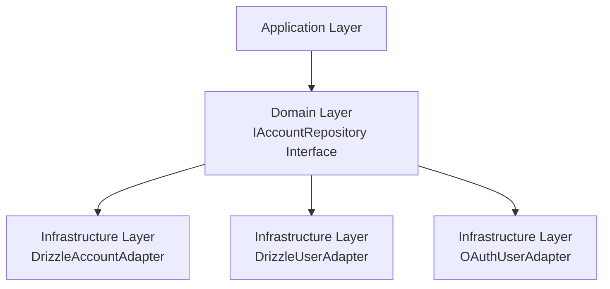

# Design: Fix Linting Errors in Identity Repository Files

## Technical Approach

This design addresses 14 linting errors in Identity service repository files by applying TypeScript best practices and strict linting rules. The fixes focus on nullable value handling, type safety, and code clarity without modifying business logic.

Key improvements:
1. **Replace `||` with `??`**: Use nullish coalescing for optional values instead of logical OR
2. **Replace `!` with explicit null checks**: Use explicit conditions instead of non-null assertions
3. **Remove `any` types**: Use proper type annotations and generics
4. **Convert `Account` class to interface**: Follow project convention of using interfaces for data structures

## Architecture Decisions

### Decision: Use Nullish Coalescing Operator (`??`)

**Choice**: Replace logical OR (`||`) with nullish coalescing (`??`) for handling null/undefined values
**Alternatives considered**: Keep using `||` operator
**Rationale**: `??` only triggers on `null` or `undefined`, while `||` triggers on all falsy values (0, "", false). This prevents unintended behavior when falsy values are valid (e.g., empty string, zero). Matches Context7 guidance patterns.

### Decision: Explicit Null Checks Instead of Non-Null Assertions

**Choice**: Replace `!` operator (non-null assertion) with explicit null checks
**Alternatives considered**: Keep using `!` operator with type assertions
**Rationale**: Non-null assertions (`!`) bypass TypeScript's type checking and can lead to runtime errors if the value is actually null/undefined. Explicit checks (`value == null`, `value === undefined`) are safer and align with `strict-boolean-expressions` linting rule.

### Decision: Remove `any` Types

**Choice**: Replace `any` with proper type annotations or `unknown`
**Alternatives considered**: Keep using `any` for convenience
**Rationale**: `any` defeats TypeScript's type safety. Use `unknown` for truly unknown types and proper generics for flexible types. Follows project guideline: "Never Use `any`".

### Decision: Convert `Account` Class to Interface

**Choice**: Convert `Account` class to interface in `IAccountRepository.ts`
**Alternatives considered**: Keep `Account` as class with definite assignment assertions (`!`)
**Rationale**: The `Account` class is never instantiated with `new` - it's only used as a type. According to project guidelines: "Prefer Interfaces for Objects, Types for Unions". This eliminates the need for definite assignment assertions (`!`) which are flagged by linting.

## Data Flow

No change to data flow - this is purely a code quality improvement.



## File Changes

| File | Action | Description |
|------|--------|-------------|
| `Identity/src/infrastructure/database/repositories/DrizzleAccountAdapter.ts` | Modify | Replace `||` with `??` for optional values; fix any remaining linting issues |
| `Identity/src/infrastructure/database/repositories/DrizzleUserAdapter.ts` | Modify | Replace `!user.id` with explicit null check; replace `any` with proper types; fix non-null assertions |
| `Identity/src/infrastructure/database/repositories/OAuthUserAdapter.ts` | Modify | Replace `||` with `??` for optional values; remove non-null assertions (`result[0]!`) |
| `Identity/src/domain/repositories/IAccountRepository.ts` | Modify | Convert `Account` class to interface; remove definite assignment assertions (`!`) |

## Interfaces / Contracts

### Updated `Account` Interface

```typescript
// Identity/src/domain/repositories/IAccountRepository.ts

import { PermissionLevel } from '../types/Role'
import { User } from '../entities/User'
import type { AccountType } from '../types/AccountType'

/**
 * @interface Account
 * @description Data structure for account entities
 */
export interface Account {
  id: string
  name: string
  type: AccountType
  ownerId: string
  createdAt: Date
  updatedAt: Date
}

/**
 * @class IAccountRepository
 * @description Port (abstract class) for account persistence operations
 */
export abstract class IAccountRepository {
  /**
   * Creates a new account and assigns the user as OWNER
   */
  abstract createAccountAndAssignOwner(
    accountName: string,
    type: AccountType,
    userId: string
  ): Promise<Account>
}
```

## Testing Strategy

| Layer | What to Test | Approach |
|-------|-------------|----------|
| Linting | All linting errors resolved | Run `bun run lint` in Identity service |
| Unit | No functional changes | Existing tests should pass without modification |
| Integration | Database operations unchanged | Verify repository methods still work correctly |

## Migration / Rollout

No migration required. These are code quality improvements that don't affect data or functionality.

## Open Questions

- [ ] None - All linting errors have clear resolution paths based on proposal and Context7 guidance
